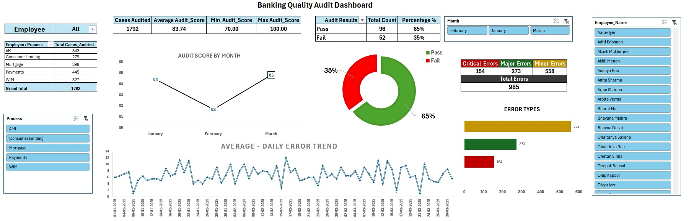

# Banking Quality Audit Dashboard

## 📌 Project Overview

This project demonstrates an end-to-end Banking Quality Audit process using Microsoft Excel. It covers data validation, data cleaning, quality checks, KPI calculation, data modeling, and an interactive dashboard for management reporting.

---

## 🎯 Business Objective

To monitor audit quality across banking operations by:

- Tracking audit scores
- Monitoring Pass vs Fail audits
- Analyzing error categories
- Measuring employee performance
- Identifying quality trends

---

## 📂 Dataset

The project consists of multiple related datasets:

- Employee Master
- Attendance
- Daily Production
- QC Audit
- Banking MIS Raw Data

---

## 🧹 Data Cleaning & Validation

Performed extensive data quality checks including:

- Missing value treatment
- Duplicate record removal
- Employee ID validation
- Date validation
- Email validation
- Business rule validation
- Text standardization using TRIM() and PROPER()
- Cross-file validation using Employee Master
- QC Audit Error Log preparation

---

## 📊 Dashboard Features

- Total Cases Audited
- Average Audit Score
- Minimum & Maximum Audit Score
- Pass vs Fail Analysis
- Error Category Analysis
- Monthly Audit Score Trend
- Daily Error Trend
- Employee-wise Analysis
- Process-wise Analysis
- Interactive Slicers

---

## 🛠 Tools Used

- Microsoft Excel
- Power Query
- Power Pivot
- Data Model
- Pivot Tables
- Pivot Charts
- Slicers

---

## 📁 Repository Structure

```
Data/
Documentation/
Dashboard/
Images/
README.md
```

---

## 🚀 Skills Demonstrated

- Data Cleaning
- Data Validation
- Data Modeling
- Business Analysis
- Dashboard Design
- KPI Reporting
- Data Quality Management

---

## 📸 Dashboard Preview



---

## 👨‍💻 Author

Vinoth G R
Data Analyst | Excel | SQL | Python | Power BI